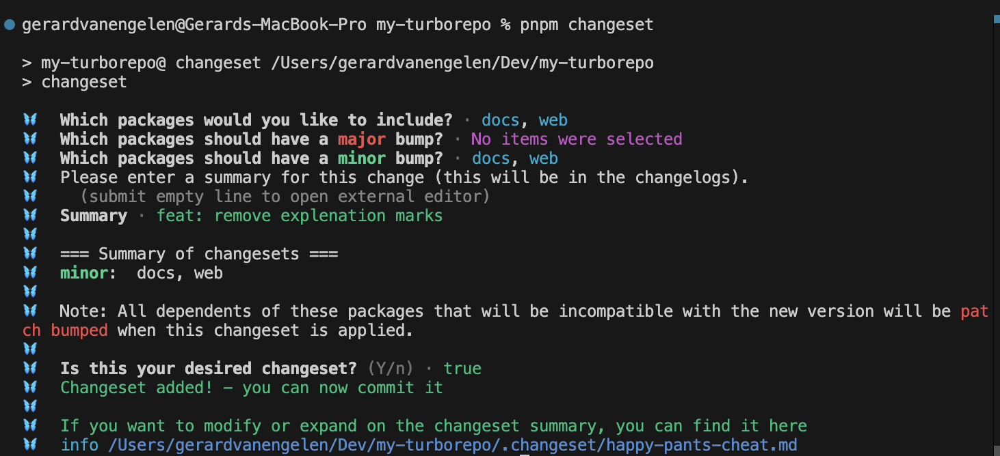
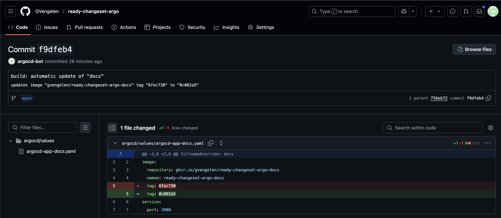

# Step-by-Step: Monorepo to GitOps with ArgoCD

This guide walks you through setting up a Turborepo monorepo, containerizing your apps, automating releases, and deploying to Kubernetes with ArgoCD and automatic image updates.

---

## 1. Create the Turborepo App

```sh
npx create-turbo@latest my-turborepo
cd my-turborepo
```

## 2. Add Dockerfiles to Your Apps

For each app (e.g., `apps/web`, `apps/docs`), add a `Dockerfile`. Example for Next.js:

```Dockerfile
# apps/web/Dockerfile
FROM node:18-alpine AS base
WORKDIR /app
RUN corepack enable && corepack prepare pnpm@9.0.0 --activate

# Install dependencies
FROM base AS deps
COPY package.json pnpm-lock.yaml pnpm-workspace.yaml ./
COPY turbo.json ./
COPY packages ./packages
COPY apps/web ./apps/web
RUN pnpm install --frozen-lockfile --prefer-offline

# Build
FROM base AS builder
COPY --from=deps /app .
RUN pnpm turbo run build --filter="@repo/ui..." --filter="web..."

# Production
FROM base AS runner
WORKDIR /app
ENV NODE_ENV=production
ENV NEXT_TELEMETRY_DISABLED=1
RUN addgroup --system --gid 1001 nodejs && adduser --system --uid 1001 nextjs
COPY --from=builder --chown=nextjs:nodejs /app/apps/web/public ./apps/web/public
COPY --from=builder --chown=nextjs:nodejs /app/apps/web/.next/standalone ./
COPY --from=builder --chown=nextjs:nodejs /app/apps/web/.next/static ./apps/web/.next/static
USER nextjs
EXPOSE 3000
CMD ["node", "apps/web/server.js"]
```

Repeat for `apps/docs` (see `apps/docs/Dockerfile`).

---

## 3. Add Changesets for Versioning

Install and initialize Changesets:

```sh
pnpm add -D @changesets/cli
pnpm changeset init
```

Follow prompts to set up versioning and changelog management.

---

## 4. Add GitHub Actions for CI/CD

Add workflows in `.github/workflows/` (see `on-tag.yaml`).
- On tag push (e.g., `web@1.2.3`), build and push Docker images to GHCR.
- Use the provided `on-tag.yaml` as a template.

---

## 5. Set Up a KinD Cluster

Install [KinD](https://kind.sigs.k8s.io/) and create a cluster:

```sh
kind create cluster --name my-turborepo
```

---

## 6. Install ArgoCD

```sh
kubectl create namespace argocd
kubectl apply -n argocd -f https://raw.githubusercontent.com/argoproj/argo-cd/stable/manifests/install.yaml
```

Port-forward the ArgoCD UI:

```sh
kubectl port-forward svc/argocd-server -n argocd 8080:80
```

Get the initial admin password:

```sh
kubectl -n argocd get secret argocd-initial-admin-secret -o jsonpath="{.data.password}" | base64 -d
```

---

## 7. Apply the ArgoCD App of Apps

Apply the bootstrap manifest:

```sh
kubectl apply -f ./argocd/app-of-apps.yaml
```

This will register all ArgoCD-managed apps defined in `argocd/apps/`.

---

## 8. Add Your Web Applications to ArgoCD

Define each app as an ArgoCD Application (see `argocd/apps/argocd-app-web.yaml` and `argocd-app-docs.yaml`).

Example:
```yaml
apiVersion: argoproj.io/v1alpha1
kind: Application
metadata:
  name: web
  namespace: argocd
  annotations:
    argocd-image-updater.argoproj.io/image-list: "web=ghcr.io/<your-ghcr-namespace>/web"
    ...
spec:
  project: default
  sources:
    - repoURL: https://github.com/<your-org>/<your-repo>.git
      targetRevision: HEAD
      ref: values
    - repoURL: https://github.com/<your-org>/<your-repo>.git
      targetRevision: HEAD
      path: charts/next-app
      helm:
        valueFiles:
          - $values/argocd/values/argocd-app-web.yaml
  destination:
    server: https://kubernetes.default.svc
    namespace: web
  syncPolicy:
    automated:
      prune: true
      selfHeal: true
    syncOptions:
      - CreateNamespace=true
```

---

## 9. Add the ArgoCD Image Updater

he image updater is defined as an Argo CD Application in your repository (see `argocd/apps/argocd-image-updater.yaml`). Here is an example configuration:

```yaml
apiVersion: argoproj.io/v1alpha1
kind: Application
metadata:
  name: argocd-image-updater
  namespace: argocd
  annotations:
    argocd.argoproj.io/sync-wave: "5"
spec:
  project: default
  sources:
    - repoURL: https://argoproj.github.io/argo-helm
      targetRevision: 0.11.0
      chart: argocd-image-updater
      helm:
        values: |
          config:
            gitCommitTemplate: |
              build: automatic update of "{{ .AppName }}"

              {{ range .AppChanges -}}
              updates image "{{ .Image }}" tag "{{ .OldTag }}" to "{{ .NewTag }}"
              {{ end -}}
            applicationsAPIKind: kubernetes
            logLevel: info
            gitCommitUser: "argocd-bot"
            gitCommitMail: "argocd-bot@example.com"
            gitCommitSigningKey: ""
            gitCommitSignOff: "false"
            gitCommitSigningMethod: "none"
            disableKubeEvents: "false"
  destination:
    server: 'https://kubernetes.default.svc'
    namespace: argocd
  syncPolicy:
    syncOptions:
    - CreateNamespace=true
    - ServerSideApply=true
    automated:
      selfHeal: true
      prune: true
```

---

## 10. Annotate Your ArgoCD Apps for Image Updates

Add the required annotations to your ArgoCD Application manifests:

```yaml
metadata:
  annotations:
    argocd-image-updater.argoproj.io/image-list: "web=ghcr.io/<your-ghcr-namespace>/web"
    argocd-image-updater.argoproj.io/web.helm.image-tag: image.tag
    argocd-image-updater.argoproj.io/web.helm.image-name: image.repository
    argocd-image-updater.argoproj.io/web.update-strategy: "newest-build"
    argocd-image-updater.argoproj.io/write-back-method: "git:secret:argocd/ghcr-repo-creds"
    argocd-image-updater.argoproj.io/git-repository: https://github.com/<your-org>/<your-repo>.git
    argocd-image-updater.argoproj.io/write-back-target: "helmvalues:/argocd/values/argocd-app-web.yaml"
    argocd-image-updater.argoproj.io/git-branch: main
```

---

## 11. Configure Git Write-Back with a GitHub App Secret

Follow the steps in `docs/ARGOCD.md` to create a GitHub App, generate a private key, and create the Kubernetes secret:

```sh
kubectl create secret generic ghcr-repo-creds -n argocd \
  --from-literal=url="https://github.com/<your-username-or-org>" \
  --from-literal=type="git" \
  --from-literal=githubAppID="<your-app-id>" \
  --from-literal=githubAppInstallationID="<your-installation-id>" \
  --from-file=githubAppPrivateKey=</path/to/your/private-key.pem>
```

---

## 12. Typical Developer Flow: From Code Change to Production

This section describes the end-to-end workflow for contributing changes and seeing them deployed automatically via GitOps:

1. **Make a Code Change**
   - Edit code in your app (e.g., `apps/web/` or `apps/docs/`).

2. **Add a Changeset**
   - Run:
     ```sh
     pnpm changeset
     ```
   - Follow the prompts to describe your change and select affected packages.
   

3. **Create a Pull Request (PR)**
   - Commit your changes (including the new `.changeset/` file) and push to a feature branch.
   - Open a PR against `main`.

4. **Merge the PR**
   - Once approved, merge your PR. This does **not** publish a new release yet.

5. **Wait for the Release PR**
   - The Changesets GitHub Action will open a new PR (the "release PR") that bumps versions and updates changelogs.

6. **Merge the Release PR**
   - Review and merge the release PR. This triggers the release workflow.

7. **Wait for the Build and Publish**
   - The GitHub Actions workflow will build and publish a new Docker image to GHCR, tagged with the new version and `latest`.

8. **ArgoCD Image Updater Detects the New Image**
   - The ArgoCD Image Updater will detect the new image tag in GHCR.
   - It will update the image tag in the appropriate Helm values file (e.g., `argocd/values/argocd-app-web.yaml`) and commit this change to the repository.
   

9. **ArgoCD Deploys the New Version**
   - ArgoCD will sync the updated application and deploy the new image to your cluster automatically.

---

This workflow ensures all changes are versioned, reviewed, released, and deployed in a fully automated, auditable GitOps pipeline.
